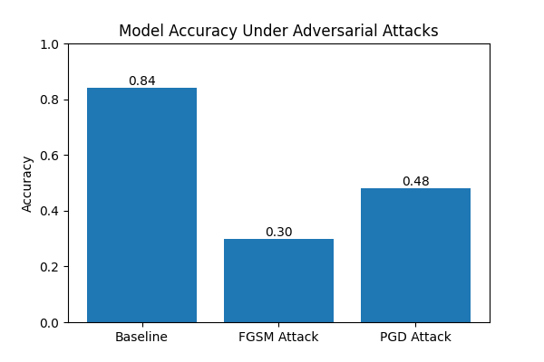

# Adversarial-AttackDefense
# Secure and Private AI
## Adversarial Robustness of an MLP on the Adult Income Dataset
Consider this as milestone 1 in which we have finished following steps
Milestone1:
-

### Project Overview
This project investigates the robustness of a machine learning model against adversarial attacks. A Multi-Layer Perceptron (MLP) neural network is trained on the UCI Adult Income dataset to predict whether an individual's income exceeds $50K per year based on demographic and socioeconomic attributes.

The robustness of the trained model is evaluated using adversarial attacks.

---

## Dataset

Dataset: **UCI Adult Income Dataset**

Files used:
- `adult.data` (training dataset)
- `adult.test` (testing dataset)

After preprocessing:
- Training samples: **30,162**
- Testing samples: **15,060**
- Features after encoding: **104**

Target variable:
- `0` → Income ≤ 50K
- `1` → Income > 50K

---

## Model

Baseline model: **Multi-Layer Perceptron (MLP)**

Architecture:
- Input layer: 104 features
- Hidden layer 1: 128 neurons
- Hidden layer 2: 64 neurons
- Activation: ReLU
- Optimizer: Adam

---

## Adversarial Attacks

Two adversarial attacks are implemented:

### FGSM (Fast Gradient Sign Method)
A single-step gradient-based attack that perturbs input features.

### PGD (Projected Gradient Descent)
An iterative gradient-based attack that applies multiple perturbation steps.

---

## Results

| Scenario | Accuracy |
|--------|--------|
| Baseline Model | ~85% |
| FGSM Attack | ~25% |
| PGD Attack | ~45% |

The results show that adversarial perturbations significantly reduce model accuracy.

---

## Installation

Install dependencies:
_pip install -r requirements.txt_

## To run the project:
- _python train.py_
- _python evaluate.py_

## Next milestone:
- Attack Propagation Modeling(will construct a feature dependency graph to capture relationships between variables in tabular data)
- Dependency-Aware Adversarial Attacks
- Adversarial Defense Mechanism
- Robustness Evaluation
- Final Visualization and Demonstration

